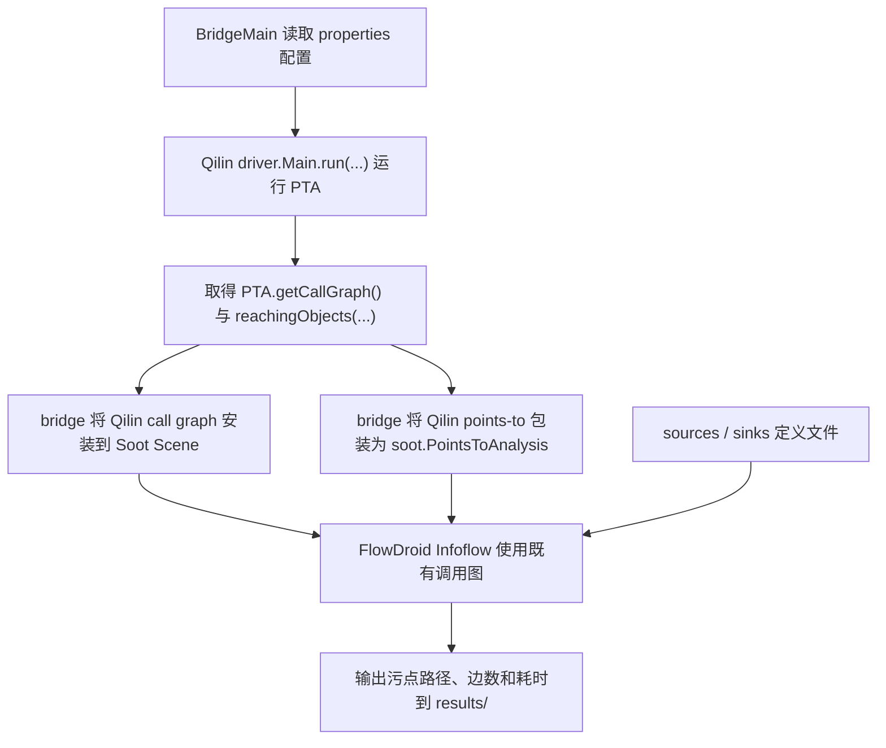

# 从 Qilin 到 FlowDroid：qilin-FD 入门

本文假设你了解 Qilin 的指针分析和 Soot/Jimple，但还没有使用过 FlowDroid。
本工程的目标不是改变 FlowDroid，而是把它作为一个观测工具：更换 Qilin PTA 后，
观察相同 source/sink 问题下，污点分析结果和耗时如何变化。

## 1. FlowDroid 在这里做什么

污点分析关心一个问题：来自外部或不可信位置的数据，能否传播到危险操作。

| 概念 | 含义 | 本工程示例 |
| --- | --- | --- |
| source | 污点起点，即把值视为不可信输入的方法 | `System.getenv(...)`、`request.getParameter(...)` |
| sink | 污点终点，即希望检查其参数是否受输入影响的方法 | `Runtime.exec(...)`、`PrintWriter.print(...)` |
| taint flow | 从 source 返回值到 sink 参数的一条可行数据传播链 | 环境变量进入命令执行 |
| source/sink 定义 | 告诉 FlowDroid 哪些签名扮演这两个角色的文本文件 | `benchmarks/definitions/*.txt` |

FlowDroid 不会在本工程中自动判断“什么是危险方法”。例如分析 Juliet 命令注入前，
我们先从源码确认 `System.getenv("ADD")` 与 `Runtime.exec(...)`，再将两个方法签名
写入定义文件，最后让 FlowDroid 查找二者之间的传播路径。

## 2. Qilin 为什么影响 FlowDroid

FlowDroid 的数据传播不只需要语句本身，还需要两项全程序信息：

| 信息 | 解决的问题 | 由谁提供 |
| --- | --- | --- |
| call graph | 一个调用语句可能进入哪些目标方法，污点能否跨方法继续传播 | `backend=qilin` 时由 Qilin 提供 |
| points-to / alias | 两个引用是否可能指向同一对象，字段写入的污点能否从另一个引用读出 | 顶层设置 `aliasing=pts` 且 `backend=qilin` 时 FlowDroid 通过 bridge 查询 Qilin |

因此，对 Qilin 的 PTA 实现做优化后，即使 FlowDroid 算法保持不变，报告的污点路径数量、
精度和运行时间也可能变化。这正是 `qilin-FD` 的实验用途。

## 3. 一次 `backend=qilin` 分析的执行顺序



对应代码入口如下：

| 类 | 职责 |
| --- | --- |
| `BridgeMain` | 选择配置文件和 `qilin` / `native` 后端 |
| `AnalysisConfig` | 将 properties 转为 Qilin 参数与 FlowDroid 配置 |
| `QilinFlowDroidBackend` | 先运行 Qilin，再运行使用其结果的 FlowDroid |
| `QilinPointsToAnalysisAdapter` | 把 FlowDroid 的 classic-Soot points-to 查询转发到 `PTA` |

`native` 后端不运行 Qilin，而让 FlowDroid/Soot 自己构建分析所需信息，可作为比较基线。

## 4. Qilin JAR 如何替换

工程默认从 `lib/qilin/Qilin-0.9.8-SNAPSHOT.jar` 加载 Qilin。该文件来自
classic-Soot Qilin 项目，并已包含 Tamiflex 反射建模的 local 登记修复。

将另一个兼容 JAR 放到同一目录后，可在一次实验中覆盖默认版本：

```powershell
.\gradlew.bat verifySmokeQilin -PqilinJar=lib/qilin/Qilin-my-optimization.jar
```

替换 JAR 必须保持以下边界：

| 必须兼容的能力 | 用途 |
| --- | --- |
| `driver.Main.run(String[])` 返回 `qilin.core.PTA` | bridge 启动 Qilin 分析 |
| `PTA.getCallGraph()` | 给 FlowDroid 提供 classic-Soot 调用图 |
| `PTA.reachingObjects(...)` | 给 FlowDroid 提供 alias/points-to 查询 |
| classic `soot.*` 类型与 FlowDroid 所用 Soot 版本兼容 | 两个组件能够在同一个 JVM 中交换对象 |

SootUp 版本的 Qilin 使用 `sootup.core.*` 类型，不能仅通过换这个 JAR 接入当前 FlowDroid。

## 5. 工程配置参数

### 5.1 构建和 JAR 选择

| 参数或位置 | 默认值 | 作用 |
| --- | --- | --- |
| `lib/qilin/Qilin-0.9.8-SNAPSHOT.jar` | 已放入工程 | 默认 Qilin PTA 实现 |
| Gradle `-PqilinJar=<path>` | 上述本地 JAR | 为某次构建选择另一个兼容 Qilin JAR |
| `compatibleFlowDroidVersion` | `2.15.1` | `build.gradle` 中固定的独立 FlowDroid 版本 |

### 5.2 配置文件字段

这些字段写在 `benchmarks/config/*.properties` 中。目标程序与两条路线共用的
FlowDroid 条件是顶层字段，后端 flags 只保留该后端特有的分析选项。

| 字段 | 是否必要 | 作用 | 示例 |
| --- | --- | --- | --- |
| `backend` | 是 | 选择执行方向 | `qilin`、`native` |
| `label` | 否 | 实验标签 | `smoke-qilin` |
| `appPath` | 是 | 被分析的应用 JAR 或目录 | `build/smoke/qilinfd-smoke.jar` |
| `libraries` | 否 | 应用依赖库路径 | `benchmarks/securibench-micro/lib` |
| `mainClass` | 是 | 普通 Java 主类 | `dev.qilinfd.bench.SimpleLeak` |
| `jre` | 通常是 | 目标程序使用的 JRE | `benchmarks/JREs/jre1.8.0_121_debug` |
| `reflectionLog` | 否 | 可选反射日志，当前交给 Qilin 路线 | `benchmarks/dacapo2006/eclipse-refl.log` |
| `sources` | 是 | 公共 source 定义文件 | `benchmarks/definitions/smoke-sources.txt` |
| `sinks` | 是 | 公共 sink 定义文件 | `benchmarks/definitions/smoke-sinks.txt` |
| `output` | 否 | 结果文件 | `results/smoke-qilin.txt` |
| `aliasing` | 否 | 两条路线共用的 FlowDroid alias 策略 | `pts` |
| `threads` | 否 | FlowDroid 数据流阶段线程数 | `1` |
| `timeoutSeconds` | 否 | FlowDroid 数据流超时秒数 | `300` |
| `qilinFlags` | Qilin 方向是 | 仅包含 Qilin PTA/建图选项 | `-pae -pta=insens` |
| `nativeFlags` | native 方向是 | 仅包含 native Soot 建图选项 | `-cgalgo=SPARK` |

完整的 `qilinFlags` 和 `nativeFlags` 参数表以项目入口文档
`README.md` 中的配置章节为准。

### 5.3 DaCapo 配置中的输入和 Qilin 参数

DaCapo Eclipse 默认配置中，程序输入放在顶层字段：

| 字段 | 含义 |
| --- | --- |
| `appPath=benchmarks/dacapo2006/eclipse.jar` | 被分析的应用 JAR |
| `reflectionLog=benchmarks/dacapo2006/eclipse-refl.log` | 解析反射调用所使用的日志 |
| `libraries=benchmarks/dacapo2006/eclipse-deps.jar` | 应用库依赖 |
| `mainClass=dacapo.eclipse.Main` | 分析入口类 |
| `jre=benchmarks/JREs/jre1.6.0_45` | 全程序分析所使用的 JRE |
| `aliasing=pts` | FlowDroid 查询 Qilin points-to 结果作为 alias 信息 |

其 `qilinFlags` 含义如下，解释来自 Qilin `driver.PTAOption` 与 `CoreConfig`：

| 参数 | 含义 |
| --- | --- |
| `-pae` | 使用更精确的数组元素类型，而不是统一按 `java.lang.Object` 处理 |
| `-pe` | 更精确地建模异常流，减少所有异常被粗略合并带来的别名噪声 |
| `-clinit=ONFLY` | 按分析发现情况加载类初始化方法 `<clinit>` |
| `-lcs` | 对 String / Exception 等忽略类型限制 heap context，降低上下文膨胀 |
| `-mh` | 按类型合并 `StringBuilder`、`StringBuffer`、`Throwable` 等 heap |
| `-pta=insens` | 上下文不敏感 PTA |

运行 Qilin 前，bridge 会把顶层的路径与入口字段转换为 Qilin driver 所需的
`-apppath`、`-reflectionlog`、`-libpath`、`-mainclass` 与 `-jre` 参数。

## 6. 无参 DaCapo Eclipse 配置

`BridgeMain` 无命令行参数时会读取
`benchmarks/config/dacapo-eclipse-qilin.properties`。bridge 将公共输入字段与
`qilinFlags` 合成为传给 Qilin JAR 的完整参数：

```text
-pae -pe -clinit=ONFLY -lcs -mh
-apppath benchmarks/dacapo2006/eclipse.jar
-reflectionlog benchmarks/dacapo2006/eclipse-refl.log
-libpath benchmarks/dacapo2006/eclipse-deps.jar
-mainclass dacapo.eclipse.Main
-jre=benchmarks/JREs/jre1.6.0_45
-pta=insens
```

由于 `BridgeMain` 是 Qilin 与 FlowDroid 的组合入口，而不是单独的 Qilin driver，
配置文件还必须提供公共的 `sources` 和 `sinks`。目前新增的 Eclipse 定义只是
一个可运行实验的示例问题：检查环境变量是否流向 `Runtime.exec(String)`；实际研究时
应按你希望检查的漏洞类型替换这些定义。

该配置引用的 `benchmarks/dacapo2006/` 与 `benchmarks/JREs/` 资产需要放到本工程
相应目录，或者在配置文件中改为其实际位置。工程没有自动复制 DaCapo 与整套 JRE，
以避免把大型基准与分析依赖 JAR 混在一起。

查看实际将传给 Qilin 的参数而不运行分析：

```powershell
.\gradlew.bat run --args="print-qilin-args --config benchmarks/config/dacapo-eclipse-qilin.properties"
```

## 7. 读结果文件

Qilin 后端结果位于配置的 `output` 文件中，最重要的字段是：

| 输出字段 | 含义 |
| --- | --- |
| `pta` | 实际使用的 Qilin PTA 名称 |
| `qilinCallEdges` | Qilin 调用图边数，可用于比较不同 PTA 的可达性变化 |
| `flowDroidLeaks` | FlowDroid 发现的 source-to-sink 连接数 |
| `ptaRuntimeMs` | Qilin PTA 所用时间 |
| `flowDroidRuntimeMs` | 在已接入 Qilin 结果后，FlowDroid 数据流阶段所用时间 |
| CSV 结果行 | 每条泄漏的 source 方法/语句与 sink 方法/语句 |

实验比较时，应保持目标程序、source/sink 文件和 FlowDroid 参数不变，只替换 Qilin
JAR 或 PTA 选项；这样结果差异才主要反映 Qilin 的影响。

## 8. DaCapo Eclipse 的 Qilin 修复

FlowDroid 在正式污点传播前会使用 `FlowDroidLocalSplitter` 拆分可达方法体中的局部变量。
此前的问题定位到 Qilin `qilin.core.reflection.TamiflexModel`：处理
`Constructor.newInstance(...)`、`Method.invoke(...)` 与反射数组读取时，它创建名称为
`intermediate/...` 的 `JimpleLocal` 并插入使用该 local 的语句，却没有把 local 加到
`Body.getLocals()`。带 Eclipse 反射日志运行时可触发 7 个这类缺失项；关闭
`reflectionLog` 后缺失项为 0。Soot `SimpleLocalDefs` 按合法方法体的不变量处理
local，因此这里的根因是 Qilin 反射建模 bug，而不是 FlowDroid splitter 产生了损坏。

当前默认 Qilin JAR 已在创建这些 local 时将其加入 `Body.getLocals()`，因此 bridge
直接使用标准 `Infoflow`，不再执行补登记或输出兼容层统计。FlowDroid 正常的 local
splitting 仍然会产生临时 local；`QilinPointsToAnalysisAdapter` 会在 points-to 查询时
将它们映射回 Qilin 原始 local，从而保证 `aliasing=pts` 仍然查询 Qilin PTA。

桥接还开启了 FlowDroid 的异常传播：若数据流阶段再次异常，运行会失败，而不会将
尚未完成的分析误写成 `flowDroidLeaks=0`。
